<div align="center">

# PAYPULSE

**An integrated HR and payroll platform** — where employee records, contracts,
schedules, attendance and leave feed one payroll engine, instead of sitting in
five tables that never talk.

`FastAPI` · `PostgreSQL 16` · `SQLAlchemy 2.0` · `React` · `Vite` · `TypeScript`

**20 tables · 57 routes · 75 operations · 449 unit tests · 406 API assertions**

</div>

<div align="center">
  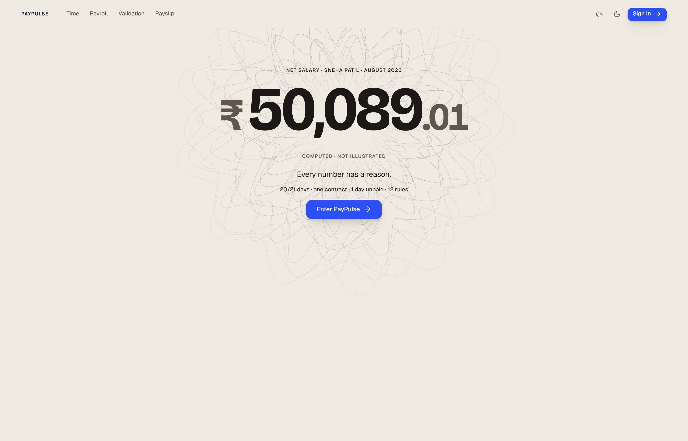
</div>

> The figure on the front door is not marketing copy. It is fetched from
> `/demo/story` against the live database — one real employee, one real
> payslip, computed by the same engine that runs the payroll.

---

## The problem this solves

Built for the Odoo Hackathon brief *"PeoplePay360 HR & Payroll"*, whose whole
complaint is the thing this fixes:

> *"Many basic HR tools store employee details, attendance, leave, and salary
> data as separate records. Real HR and payroll teams need these records to
> work together."*

So they do. A payslip here is **not a stored number** — it is derived from five
sources that must agree, and the same composition that computes it also draws
the attendance register and the leave balance. They cannot disagree, because
they are the same code.

---

## Run it

Three commands, about two minutes, nothing to install but Docker.

```bash
docker compose up -d --build
```

```bash
docker compose exec api python -m app.db.seed
```

Then open **http://localhost:5173** and sign in.

| Service | URL |
|---|---|
| **App** | http://localhost:5173 |
| API docs (Swagger) | http://localhost:8000/docs |
| OpenAPI schema | http://localhost:8000/openapi.json |
| Health check | http://localhost:8000/healthz |
| Mail inbox (Mailpit) | http://localhost:8025 |
| Postgres | `localhost:5432` · `peoplepay` / `peoplepay` |

> **Ports already taken?** Copy `.env.example` to `.env` and set
> `POSTGRES_PORT_HOST` / `API_PORT_HOST`. If you move the API off 8000, set
> `VITE_API_BASE_URL` to match — the browser calls it directly, so it needs the
> host port, not the container one.

### Demo accounts

All five use the password **`paypulse`**. Each sees a genuinely different
product — the role matrix is enforced in the API, not just hidden in the UI.

| Email | Role | Sees |
|---|---|---|
| `admin@paypulse.app` | ADMIN | Everything |
| `payroll.manager@paypulse.app` | HR_PAYROLL_MANAGER | Payroll, incl. validate and pay |
| `payroll.user@paypulse.app` | HR_PAYROLL_USER | Payroll, without the final approvals |
| `hr.manager@paypulse.app` | HR_MANAGER | People, time and leave — no payroll |
| `employee@paypulse.app` | EMPLOYEE | Only their own record |

---

## A tour of the product

### Reports — the number, and where it came from

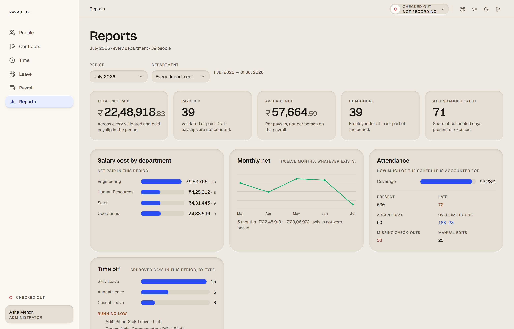

Five KPIs, salary cost by department, a twelve-month net trend and an
attendance health panel — every figure scoped to the signed-in role by the
**server**, not by hiding tiles in the browser.

An `HR_MANAGER` requesting this same endpoint gets a materially thinner
payload: the three money KPIs (`total_net_paid`, `total_gross_paid`,
`average_net_salary`) are absent, the monthly-net trend comes back empty, and
the salary-cost rows arrive with every amount stripped — `department` and
`headcount` and nothing else. The spec says "no access to payroll features", so
those numbers never leave the process.

Note the axis label — *"axis is not zero-based"*. The chart says so rather than
quietly exaggerating a trend.

### People — the register

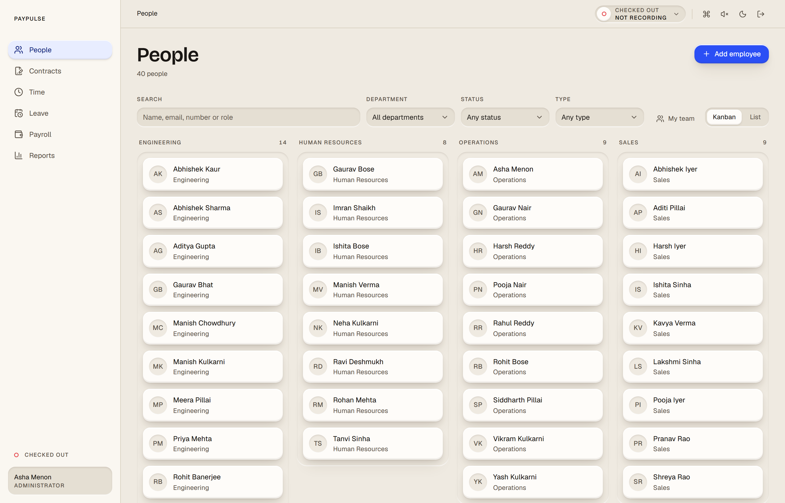

Forty employees, filterable by department, position and status. Each record
opens onto a life-of-employment strip: contracts, days worked, overtime,
missing check-outs, holidays and gaps drawn on one shared timeline.

### Contracts — many per employee, resolved by date

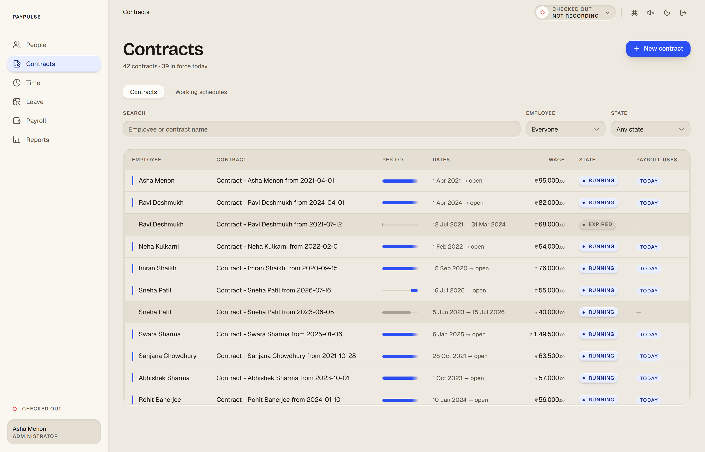

An employee holds **many contracts over time**. Payroll resolves the one valid
for the pay period, prorates across a mid-period change, and raises
`MULTI_CONTRACT_PERIOD` when a period spans two of them. Overlapping *active*
contracts are refused at write time, not reconciled later.

### Time — attendance, and the absence that has no row

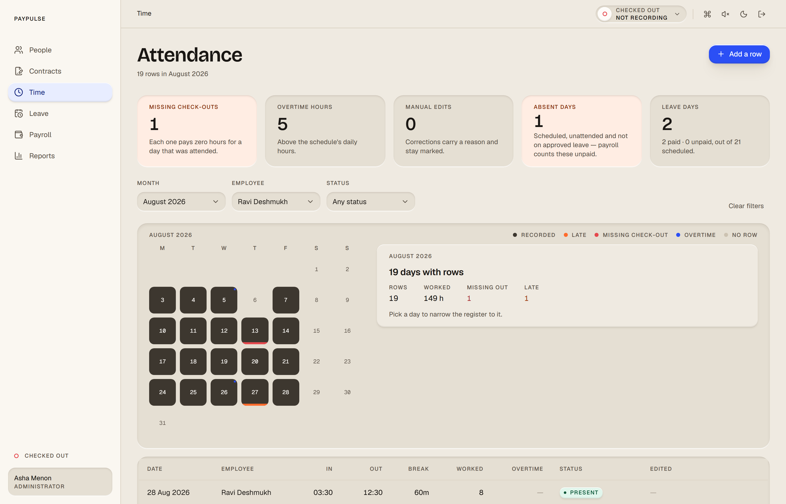

The month strip draws **every day**, not just the days with rows, because the
gaps are the point. In the August above, 19 days carry a row and **12 do not** —
yet the register reports exactly **one** absence.

The arithmetic is the whole argument. Ten of those twelve are weekends, which
the schedule never claimed. That leaves two scheduled weekdays with no row, and
one of them is covered by approved leave. One genuine absence remains.

Which is why *Absent days* and *Leave days* are asked of the server rather than
counted in the browser: a day with no row is absent only relative to the
contract schedule, the holiday calendar and approved leave — and the client
holds none of those three. Counting gaps client-side would have reported twelve
absences and disagreed with the payrun about somebody's pay.

### Leave — balances that are actually spent

<table>
<tr>
<td width="50%">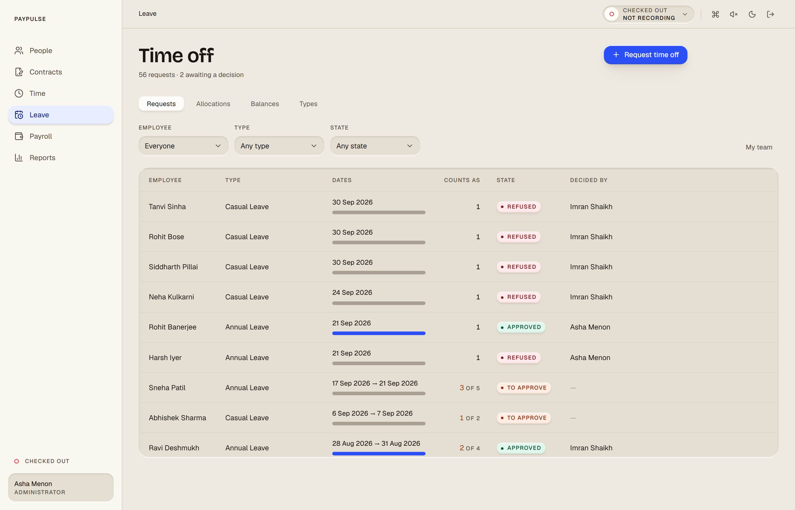</td>
<td width="50%">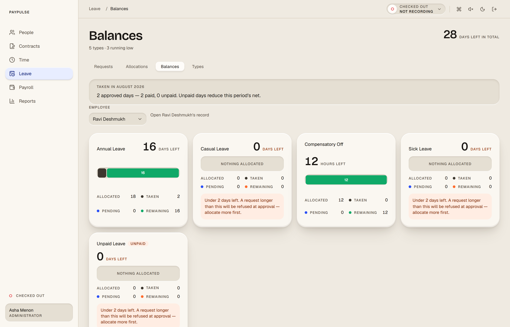</td>
</tr>
</table>

Approving a request **decrements the balance**, and approval past zero is
refused rather than warned about. Durations are schedule- and holiday-aware: a
Fri–Mon request on a five-day week is 2 days, and 1 if the Monday is a public
holiday.

Balances show what is *left*; the summary beside them shows what was *taken*,
split paid and unpaid — the same split the pay basis reads, so the two screens
cannot drift apart.

#### Every decision is attributable

<table>
<tr>
<td width="50%">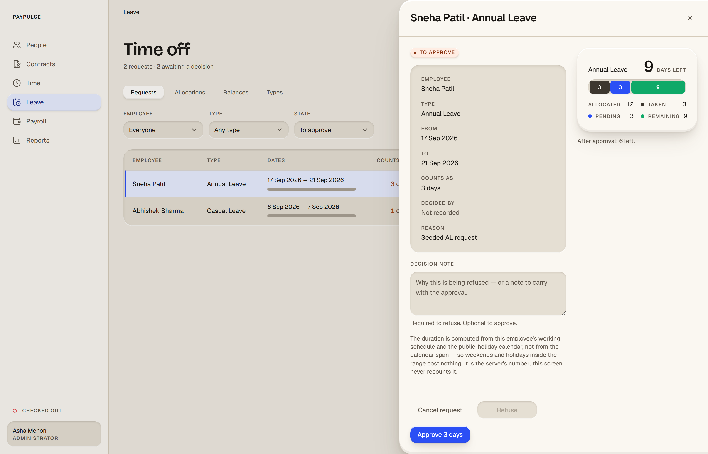</td>
<td width="50%">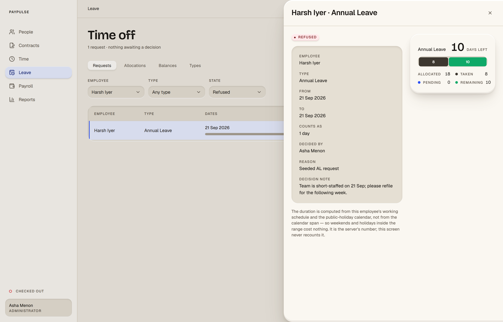</td>
</tr>
</table>

**A refusal must say why; an approval need not.** The asymmetry is deliberate —
the person told "no" is the one who needs the sentence. The note is stored on
the record and read back beside the approver's name, so a refusal can be
answered later instead of being an unexplained state change.

The same rule applies one table over, to the allocation that funds the leave.
An allocation is *proposed*, then decided — and the register carries a
**Decided by** column so a grant that was turned down says who turned it down:

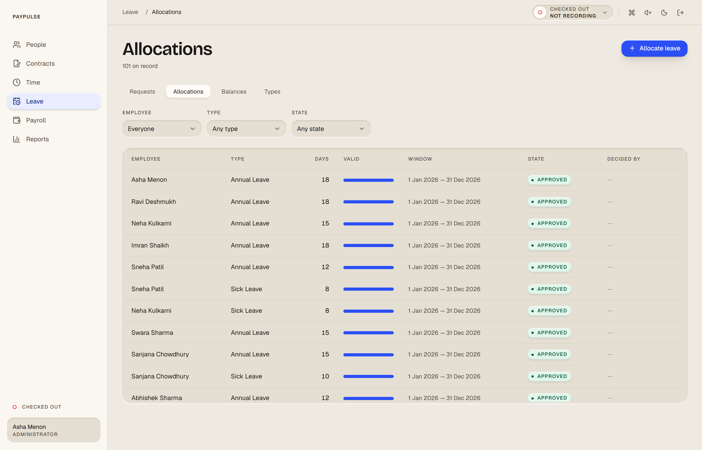

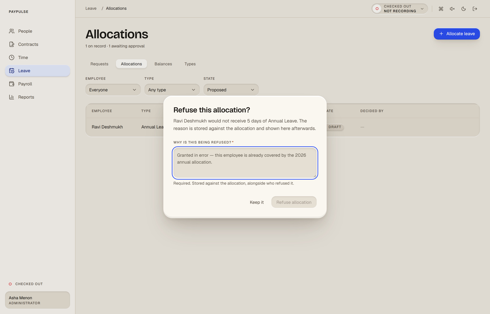

### Payroll — the run, then the cockpit

Every payrun the company has ever executed, with its period, scope and state:

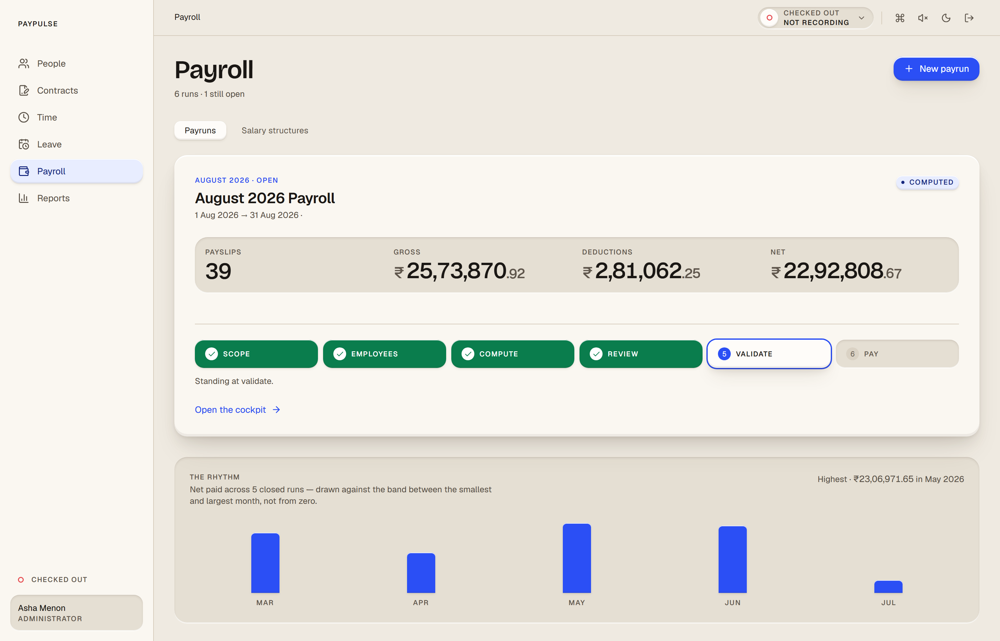

Opening one lands in the cockpit:

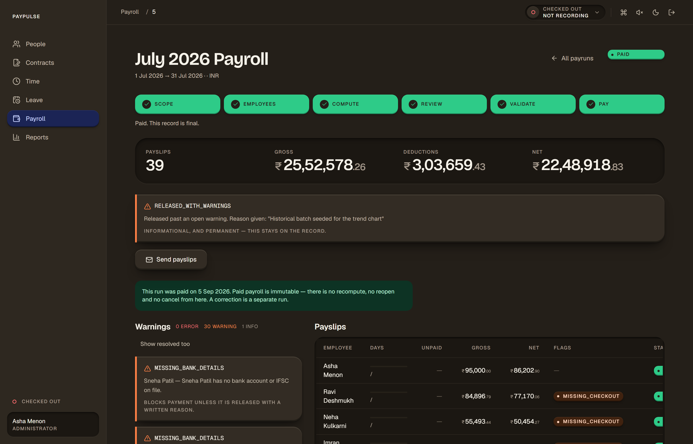

The set piece, and the screen the whole product points at. **Nothing gets paid
until it makes sense**, so the warnings are not a footnote at the bottom — they
are the left-hand column, they are a triage inbox, and every one states what it
blocks. The payslips are on the right, because they are the *consequence* of
the warnings being clear.

Four decisions worth naming:

- **`Validate` is refused, not disabled-with-a-shrug.** An open `ERROR` means
  the API answers 422 naming the errors, and the screen shows that sentence.
- **Force-pay demands a typed reason before the key enables.** Releasing past an
  open `MISSING_BANK_DETAILS` is allowed; doing it *silently* is not. The reason
  is stored on the payrun and printed on this screen forever after — visible in
  the screenshot above.
- **A PAID payrun offers no recompute path at all.** Not disabled — absent.
  Money has moved and the record stands.
- **The room is dark**, and leaving it restores the theme.

### Payslip — every number has a reason

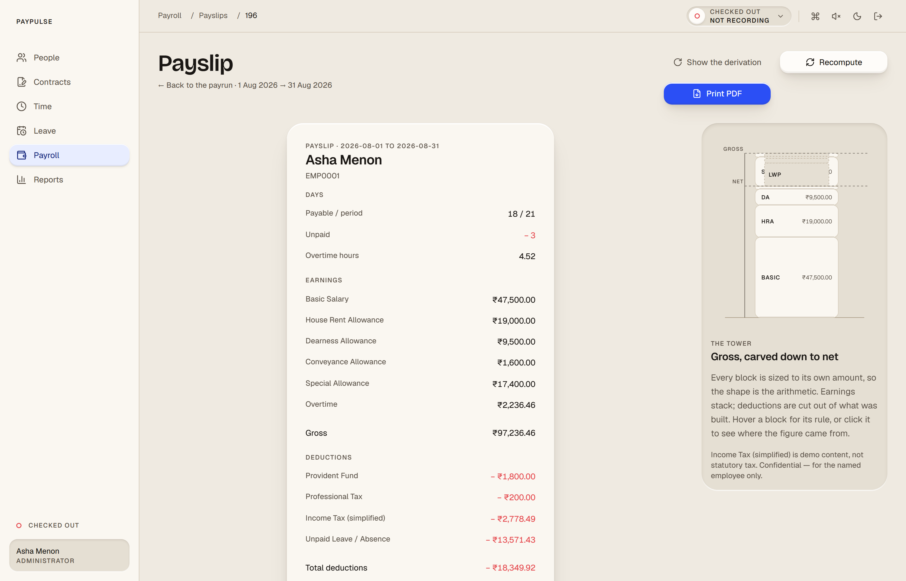

Lines, category totals and the net, with the derivation on the back face. Lines
round `HALF_UP` at line level and category totals accumulate already-rounded
amounts, so **`sum(lines) == net`** exactly. A payslip that does not reconcile
is the one thing a payslip may never do.

### Salary structures — ordered rules

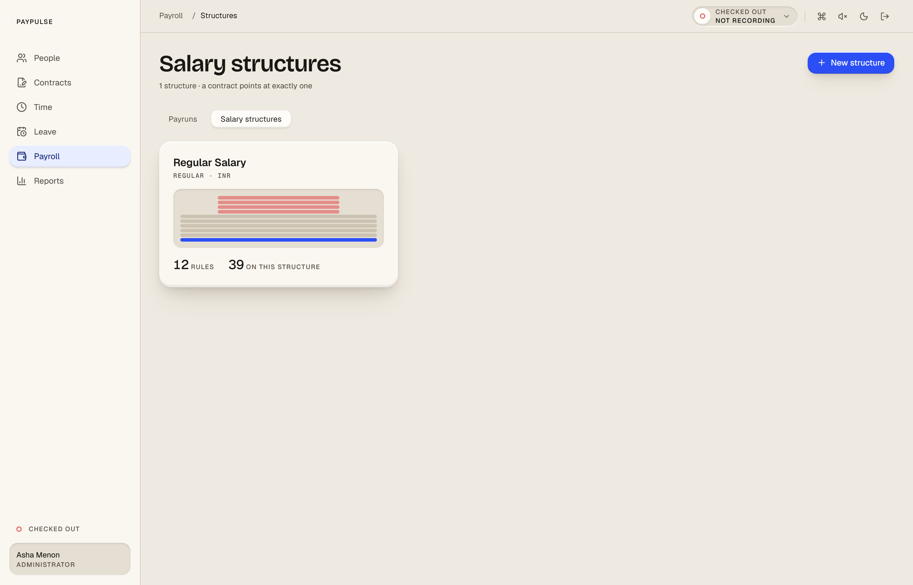

Rules evaluate in sequence and each result is visible to the next, so `SPECIAL`
can reference `BASIC`, `GROSS` can sum two categories, and `NET` can subtract
one from another. Formulas run in a sandboxed AST evaluator — never `eval()`.

### The employee's product is a different product

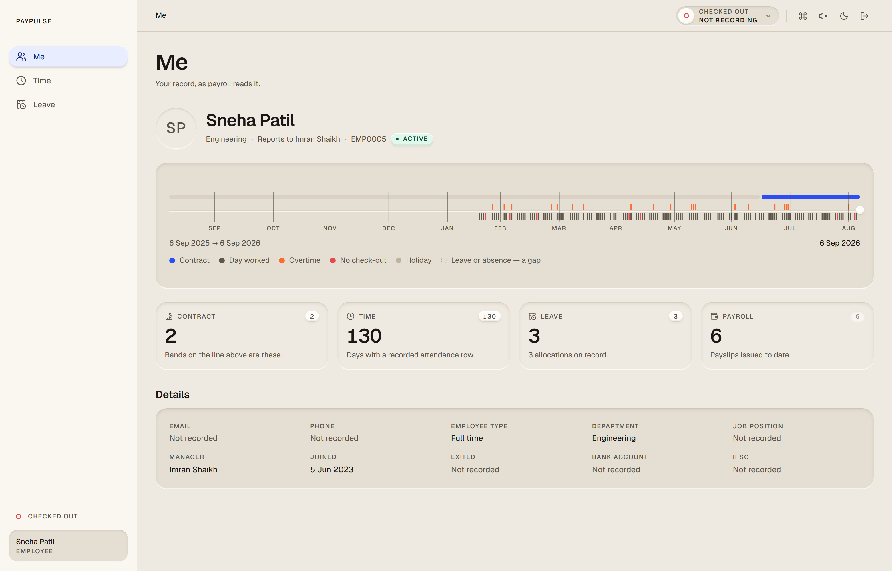

An `EMPLOYEE` does not get the full shell with items greyed out. They get a
quieter three-item product — *Me · Time · Leave* — and the API enforces the same
boundary underneath it.

---

## How it works

### System shape

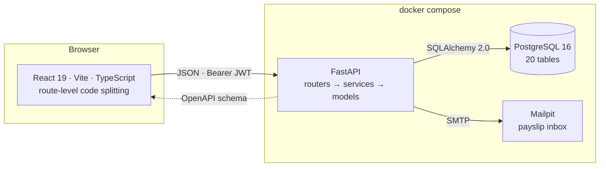
```mermaid
flowchart LR
    subgraph Browser
        UI["React 19 · Vite · TypeScript<br/>route-level code splitting"]
    end
    subgraph Docker["docker compose"]
        API["FastAPI<br/>routers → services → models"]
        DB[("PostgreSQL 16<br/>20 tables")]
        MAIL["Mailpit<br/>payslip inbox"]
    end
    UI -->|"JSON · Bearer JWT"| API
    API -->|SQLAlchemy 2.0| DB
    API -->|SMTP| MAIL
    API -.->|"OpenAPI schema"| UI
```

The OpenAPI schema is the contract between the two halves — the frontend's
types are generated from it, not hand-written.

### The payroll pipeline

A payslip is computed from five sources that must agree:

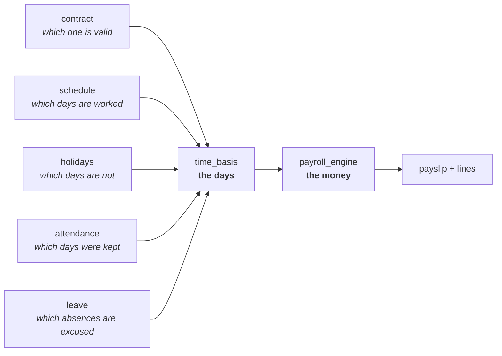
```mermaid
flowchart LR
    C["contract<br/><i>which one is valid</i>"] --> TB
    S["schedule<br/><i>which days are worked</i>"] --> TB
    H["holidays<br/><i>which days are not</i>"] --> TB
    A["attendance<br/><i>which days were kept</i>"] --> TB
    L["leave<br/><i>which absences are excused</i>"] --> TB
    TB["time_basis<br/><b>the days</b>"] --> PE
    PE["payroll_engine<br/><b>the money</b>"] --> P["payslip + lines"]
```

`time_basis` counts nothing itself. It *composes* `calendar`,
`attendance_service` and `leave_engine` — which is exactly why a payslip can
never disagree with the attendance screen or the leave balance. That
composition is the "records work together" the brief asks for.

The day arithmetic:

```
period_days   = schedule working days in the period, minus public holidays
contract_days = period_days narrowed to the contract and employment dates
unpaid_days   = unpaid leave + absence without leave
payable_days  = contract_days - unpaid_days
```

The policy is **schedule-anchored, attendance-derived absence**: you are paid
for the days your schedule and contract say you work, minus unpaid leave, minus
days absent without leave. Attendance does not *earn* pay; its absence removes
it. Absence has no row — it is the absence of one.

### Data model

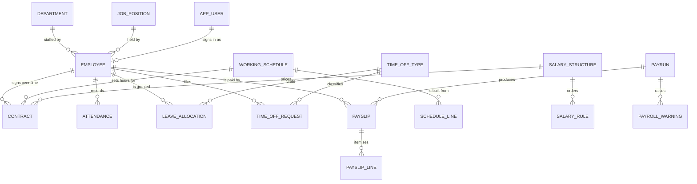
```mermaid
erDiagram
    DEPARTMENT   ||--o{ EMPLOYEE : "staffed by"
    JOB_POSITION ||--o{ EMPLOYEE : "held by"
    EMPLOYEE     ||--o{ CONTRACT : "signs over time"
    EMPLOYEE     ||--o{ ATTENDANCE : "records"
    EMPLOYEE     ||--o{ LEAVE_ALLOCATION : "is granted"
    EMPLOYEE     ||--o{ TIME_OFF_REQUEST : "files"
    EMPLOYEE     ||--o{ PAYSLIP : "is paid by"
    WORKING_SCHEDULE ||--o{ CONTRACT : "sets hours for"
    WORKING_SCHEDULE ||--o{ SCHEDULE_LINE : "is built from"
    TIME_OFF_TYPE    ||--o{ LEAVE_ALLOCATION : "funds"
    TIME_OFF_TYPE    ||--o{ TIME_OFF_REQUEST : "classifies"
    SALARY_STRUCTURE ||--o{ SALARY_RULE : "orders"
    SALARY_STRUCTURE ||--o{ CONTRACT : "prices"
    PAYRUN   ||--o{ PAYSLIP : "produces"
    PAYRUN   ||--o{ PAYROLL_WARNING : "raises"
    PAYSLIP  ||--o{ PAYSLIP_LINE : "itemises"
    APP_USER ||--o| EMPLOYEE : "signs in as"
```

### Payrun lifecycle

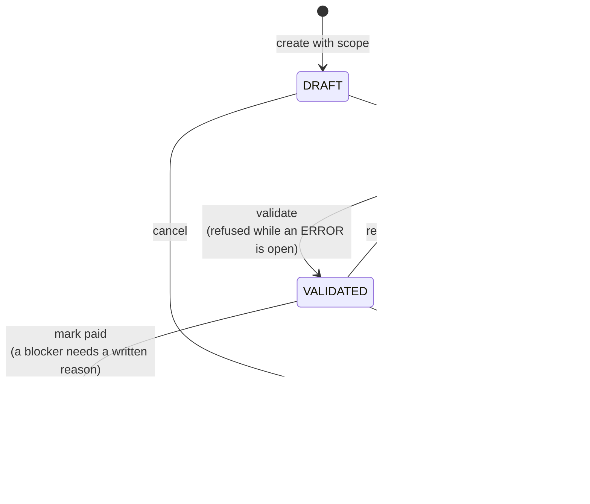
```mermaid
stateDiagram-v2
    [*] --> DRAFT: create with scope
    DRAFT --> COMPUTED: compute
    COMPUTED --> COMPUTED: recompute
    COMPUTED --> VALIDATED: validate<br/>(refused while an ERROR is open)
    VALIDATED --> COMPUTED: reopen
    VALIDATED --> PAID: mark paid<br/>(a blocker needs a written reason)
    DRAFT --> CANCELLED: cancel
    COMPUTED --> CANCELLED: cancel
    VALIDATED --> CANCELLED: cancel
    PAID --> [*]: final — immutable
```

`PAID` is terminal on purpose. Money has moved, so there is no recompute, no
reopen and no cancel from there — a correction is a separate run.

### Leave request lifecycle

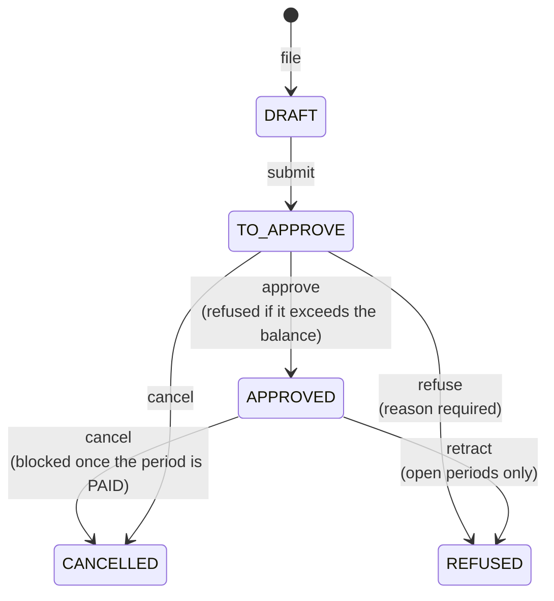
```mermaid
stateDiagram-v2
    [*] --> DRAFT: file
    DRAFT --> TO_APPROVE: submit
    TO_APPROVE --> APPROVED: approve<br/>(refused if it exceeds the balance)
    TO_APPROVE --> REFUSED: refuse<br/>(reason required)
    APPROVED --> CANCELLED: cancel<br/>(blocked once the period is PAID)
    TO_APPROVE --> CANCELLED: cancel
    APPROVED --> REFUSED: retract<br/>(open periods only)
```

Only `APPROVED` consumes a balance — and once the period is paid, the leave
that fed it can no longer be withdrawn.

### Who can do what

Enforced in `core/rbac.py` as pure policy — no FastAPI imports, unit-tested on
its own. `C`reate · `R`ead · `U`pdate · `D`elete · `A`pprove, and `*` means
**own records only**.

| Resource | ADMIN | HR_PAYROLL_MANAGER | HR_PAYROLL_USER | HR_MANAGER | EMPLOYEE |
|---|---|---|---|---|---|
| employee | CRUDA | CRUD | CRUD | CRUD | R* |
| contract | CRUDA | CRUD | CRUD | CRUD | R* |
| attendance | CRUDA | CRUD | CRUD | CRUD | CR* |
| time_off_request | CRUDA | CRUDA | CRUDA | CRUDA | CR* |
| salary_structure | CRUDA | CRUD | R | — | — |
| payrun | CRUDA | CRUD | CRU | — | — |
| payslip | CRUDA | CRUD | CRU | — | — |
| dashboard | CRUDA | R | R | R | — |

`HR_PAYROLL_USER` holds `CRU` on payruns but not `A` — it can build and compute
a run and never approve one. That gap is the separation of duties the brief
asks for, and it is a row in a table rather than an `if` in a handler.

---

## What makes it more than CRUD

The brief calls out four hard parts. Each is a real mechanism here, not a
column:

**Period-based contracts.** Resolved by date, prorated across a mid-period
change, and `MULTI_CONTRACT_PERIOD` when a period spans two. Overlapping active
contracts are refused.

**Schedule-derived hours.** Weekly hours are computed from a
day/start/end/break pattern — never typed in. A 22:00–06:00 night shift is
7 hours, not −16.

**Leave that actually consumes.** Approving decrements the balance; approval
past zero is refused. Durations skip weekends and public holidays.

**Ordered salary rules.** Sequenced evaluation over a mutable context is the
entire "totals build on earlier calculations" feature:

```python
rules[code]      = amount   # a later rule can reference it
categories[cat] += amount   # running totals per category
```

---

## Calling the API

Conventions the API keeps everywhere — see [docs/API.md](docs/API.md) for
detail:

- **Auth** — `POST /api/v1/auth/login` returns `{access_token, refresh_token, user}`.
  Send `Authorization: Bearer <access_token>`. Refresh tokens are rejected as
  access tokens, so don't mix them up.
- **Errors** — every failure returns `{code, message, field_errors[]}`.
- **Money** — serialised as strings, never floats, so nothing loses paise.
- **Collections come in two shapes.** The large, filterable ones are paged and
  return `{items, total, page, pages, page_size}` — employees, contracts,
  attendances, payruns, payslips, time-off requests and allocations. The small
  reference lists return a **bare JSON array**: departments, job positions,
  working schedules, time-off types, balances, salary structures, salary rules
  and payrun warnings. Check the shape before you reach for `.items`.
- **`page_size` caps at 200** — asking for more is a 422, not a silent clamp.

The schema is the single source of truth. Generate the client; don't hand-write
types:

```bash
npx openapi-typescript http://localhost:8000/openapi.json -o src/api/schema.d.ts
```

---

## Testing

```bash
docker compose exec api python -m pytest -q         # 449 unit tests
docker compose exec api python -m ruff check app    # lint
docker compose exec frontend npm run verify         # typecheck + tokens + build
```

The smoke suites talk to a **running** stack over real HTTP. They cover what a
`TestClient` cannot: real Postgres constraints, real middleware, real status
codes on the wire.

```bash
docker compose exec api python -m scripts.smoke_b5      # payroll, 109 assertions
docker compose exec api python -m scripts.reset_smoke   # clean up after them
```

| Suite | Covers | Assertions |
|---|---|---|
| `smoke_auth` | login, refresh, revocation | 20 |
| `smoke_b1` | org, schedules, employees | 37 |
| `smoke_b2` | contracts and resolution | 52 |
| `smoke_b25` | public holidays | 24 |
| `smoke_b3` | attendance | 67 |
| `smoke_b4` | leave, balances, decisions | 97 |
| `smoke_b5` | payroll end to end | 109 |
| | **total** | **406** |

Run `reset_smoke` between suites — they create throwaway records, and a couple
leave rows on seeded ones that it reclaims.

---

## Documentation

| Doc | Read it when |
|---|---|
| [docs/ARCHITECTURE.md](docs/ARCHITECTURE.md) | You want to know how a payslip gets computed |
| [docs/API.md](docs/API.md) | You are calling the API |
| [docs/RUNBOOK.md](docs/RUNBOOK.md) | You are running, seeding, resetting or demoing it |

---

## Layout

```
backend/
  app/
    api/v1/        routers — HTTP only, no business logic
    services/      the engines: time_basis, payroll_engine, formula, leave
    models/        SQLAlchemy 2.0 mapped classes
    schemas/       Pydantic in/out contracts
    core/          rbac, enums, security, settings
  alembic/         migrations
  scripts/         smoke suites against a running stack
  tests/           449 unit tests
frontend/
  src/
    api/           client, generated schema, hand-kept contract types
    features/      people · contracts · time · leave · payroll · dashboard
    components/    the design system
    app/           shell, routes, guards
docs/              architecture · API · runbook · images
```

<div align="center">


</div>
